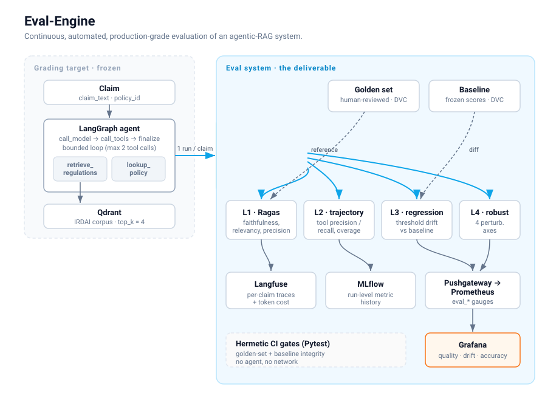
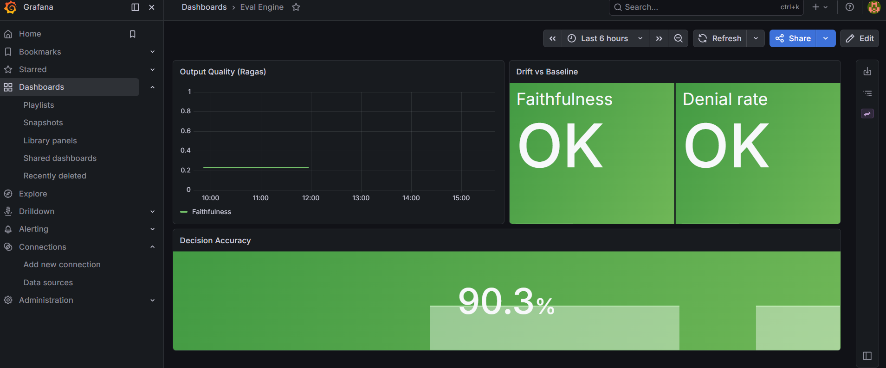

# Eval-Engine

> Continuous, automated, production-grade evaluation of an agentic-RAG system.

[](https://github.com/Prateek718/eval-engine/actions/workflows/ci.yml)
[](https://www.python.org/downloads/)
[](https://github.com/astral-sh/ruff)
[](LICENSE)

## Overview

Eval-Engine is an evaluation system for an LLM agent: it scores quality, watches for regressions against a frozen baseline, and surfaces the results on a live dashboard. The thing being graded is a deliberately minimal claim-adjudication agent — a LangGraph agentic-RAG assistant that decides whether an Indian health-insurance claim is payable, denied, or partially payable, and for how much. The agent is **frozen**: it exists only to generate adjudications for the evaluation system to grade, and is never tuned against eval results. "Production-grade" describes the evaluation machinery — the four scoring layers, the drift monitoring, the tracing, and the dashboard. The agent is scoped to exactly what the evaluation needs and no more.

The point of the project is the part that is hard in practice: not getting an agent to answer once, but knowing — continuously, automatically, and defensibly — whether it is still answering well.

## Architecture



One agent run per claim feeds every scoring layer, so all scores describe the same execution and bond to one trace. The agent retrieves regulatory clauses from Qdrant and looks up policy terms, then returns a structured adjudication. That adjudication fans out to four evaluation layers:

- **L1 — output quality (Ragas):** faithfulness, answer relevancy, and context precision, judged against the human-reviewed golden labels.
- **L2 — trajectory:** tool precision/recall and step overage, comparing the tools the agent actually used against the golden expected calls.
- **L3 — regression:** a threshold-delta drift check against a frozen baseline sheet. With a small golden set and a non-deterministic agent, distributional tests are underpowered and noisy, so drift is an explicit, owned threshold rather than a statistical test.
- **L4 — robustness:** re-runs the agent on deterministically perturbed claims (typo, whitespace/case, irrelevant suffix, number reformat — all fact-preserving) and measures whether the decision and amount stay stable.

Scores fan out to three sinks, each answering a different question: **Langfuse** holds per-claim traces and per-generation token cost (the drill-down); **MLflow** holds run-level metric history (the trend); **Prometheus**, fed via a Pushgateway, backs a **Grafana** dashboard (the at-a-glance health view). The golden set and the frozen baseline are versioned with DVC so the references review like any other artifact.

Cost is not baselined. It is per-generation, model-dependent observability data, so it is captured automatically by Langfuse for every claim and attributed per model — cost-per-adjudication stays observable for whatever model backs the agent, and re-measures itself if the model changes. Quality and drift go on the dashboard; cost lives in the tracing layer.

## Dashboard



The dashboard is provisioned from version-controlled files (datasource and dashboard JSON), so it is reproduced exactly on a fresh stack rather than clicked together by hand. Output quality trends over runs, drift flags flip from `OK` to `DRIFT` per signal when a run breaches threshold, and decision accuracy is surfaced as the headline business metric.

## Tech stack

Python 3.12 · LangGraph (agent) · Qdrant (vector store) · Gemini (agent + Ragas judge) · Ragas (L1) · Langfuse (tracing + cost) · MLflow (run tracking) · DVC + DagsHub (artifact versioning) · Prometheus + Pushgateway + Grafana (metrics + dashboard) · Docker Compose. Tooling: uv, ruff, mypy (strict), pytest, GitHub Actions CI.

L2, L3, and L4 are pure Python by design — set arithmetic, threshold deltas, and deterministic perturbations need no external evaluation library, and keeping them dependency-free keeps them fast and fully testable offline.

## Quick start

Requires [Docker](https://docs.docker.com/get-docker/), [uv](https://docs.astral.sh/uv/), and a `.env` file:

```
GEMINI_API_KEY=<your gemini key>
QDRANT_URL=http://localhost:6333
PUSHGATEWAY_URL=localhost:9091
LANGFUSE_PUBLIC_KEY=<optional — tracing disabled if absent>
LANGFUSE_SECRET_KEY=<optional>
LANGFUSE_HOST=https://cloud.langfuse.com
MLFLOW_TRACKING_URI=<optional — run tracking disabled if absent>
```

Bring up the monitoring stack (Qdrant, Pushgateway, Prometheus, Grafana):

```bash
docker compose up -d
```

Index the corpus into Qdrant, then run the evaluation against the running stack:

```bash
uv run python scripts/index.py
uv run python scripts/run_eval.py
```

Grafana is at `http://localhost:3000`. The eval run scores all claims, writes drift metrics to the dashboard, traces each claim to Langfuse, and logs the run to MLflow. Tracing, run tracking, and metrics each degrade to a no-op when their backend is not configured, so the eval runs with nothing but a Gemini key.

## Key engineering decisions

- **The agent is the grading target, not the deliverable.** It is frozen and never tuned against eval results — tuning the thing you are measuring with the thing measuring it is how eval harnesses lie to themselves. Keeping the agent tightly scoped makes the evaluation system the unambiguous subject of the work.
- **One agent run per claim feeds all layers.** Given a non-deterministic agent, scoring L1/L2/L3 against separate runs would grade different executions; a single run per claim keeps every score describing the same trace.
- **Drift is a threshold delta, not a statistical test.** At a 31-claim golden set with a non-deterministic agent, K-S / chi-square tests are underpowered and trip on run-to-run noise. An explicit, owned, config-carried threshold is the honest signal at this scale.
- **Baseline frozen against the production-shaped environment.** The reference was frozen with Qdrant running as a containerized server, not the embedded dev mode — a baseline frozen against a different retrieval backend than production would silently invalidate every drift comparison.
- **Cost in the tracing layer, not the baseline.** Cost is model- and price-dependent observability data, not a quality metric to freeze. Captured per-generation by Langfuse and attributed per model, so it stays correct across model changes instead of being a stale committed number.
- **Hermetic CI gates.** Two Pytest gates assert the golden set and the frozen baseline stay well-formed and mutually aligned — no agent, no network. Detecting a *degraded agent* requires running it, which CI deliberately does not; that detection lives in the L3 layer on the dashboard, run on the deliberate eval, not in the per-PR gate.

## Known limitations

These are conscious scope decisions for a portfolio project, not oversights — each has a clear production answer.

- **Single agent, single domain:** the eval system is wired to one claim-adjudication agent over one corpus. Generalizing to arbitrary agents would mean abstracting the agent and golden-set interfaces behind a contract.
- **Small golden set:** 31 human-reviewed claims. Enough to exercise every layer and make drift meaningful, but a production gate would want a larger, periodically-refreshed set — which is exactly why L3 is threshold-based rather than distributional.
- **Run-on-demand, not scheduled:** the evaluation is a deliberately-triggered run, not a cron/CI-scheduled job. Continuous monitoring in production would schedule it and alert on the existing drift signals.
- **Local stack, not hosted:** the full stack runs reproducibly via `docker compose up`, but is not deployed to a public URL — the dashboard is the demo artifact, and standing the stack up is one command.

## License

MIT
